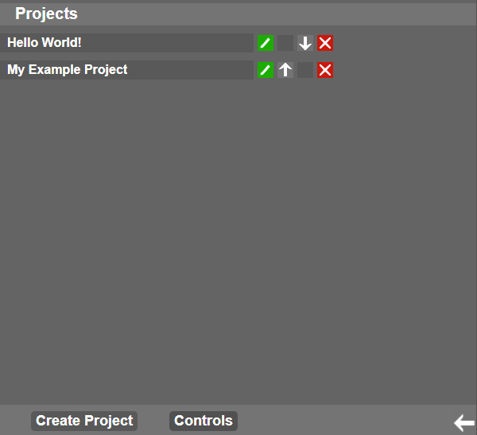

# Todo-List Frontend

 

## Requirements:
- Python (for easy to setup http.server-module). A dedicated web server is recommended for long term usage.
- Bower installation

## Installing:
1. Clone this repository

2. Install dependencies with: ```bower install```

3. #### Setting up the directory structure for Pythons http.server-module (or a dedicated web server)
   1. Create a directory "html" in your preferred location
   2. Create a subdirectory "todolist"
   3. Copy the contents of the "public_html"-folder to the "todolist"-folder

The directory structure should now look like in the image below:


## Running:
1. Navigate to the "html"-directory.

2. With python 3, run ```python -m http.server 80```, otherwise run ```python -m SimpleHTTPServer 80```

3. Open ```http://localhost/todolist/``` in your preferred browser (Tested with Google Chrome)
